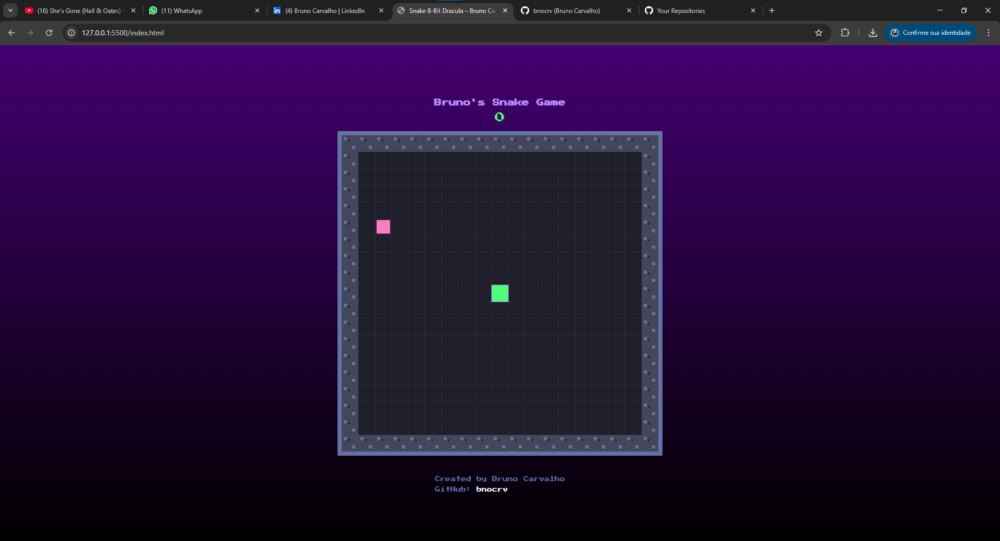

# 🐍 Snake Game 8‑Bit Dracula

Um jogo da cobrinha clássico, com visual retrô 8-bit, feito com HTML, CSS e JavaScript.  
Você pode jogar, estudar o código ou personalizar à vontade!



---

## 👨‍💻 Sobre o Autor

- **Nome:** Bruno Carvalho  
- **GitHub:** [@bnocrv](https://github.com/bnocrv)  
- **Contato:** [bnocrv@proton.me](mailto:bnocrv@proton.me)

Sinta-se à vontade para clonar, contribuir ou apenas jogar e se divertir!

---

## 🚀 Como Rodar Localmente

1. Clone este repositório:
   ```bash
   git clone https://github.com/bnocrv/snake-javascript.git
